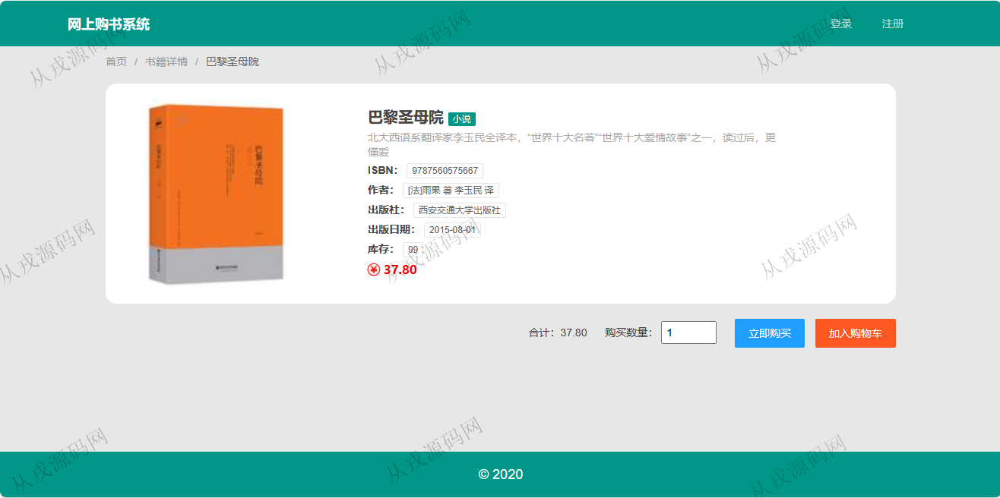
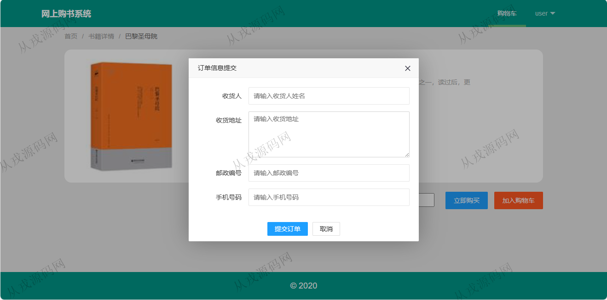
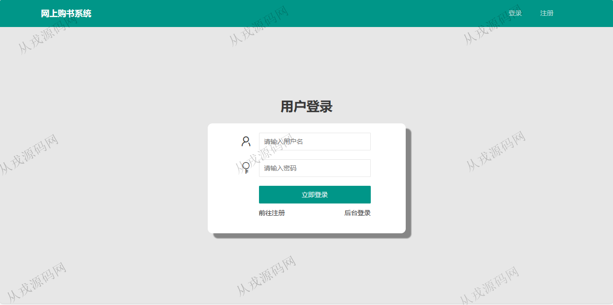
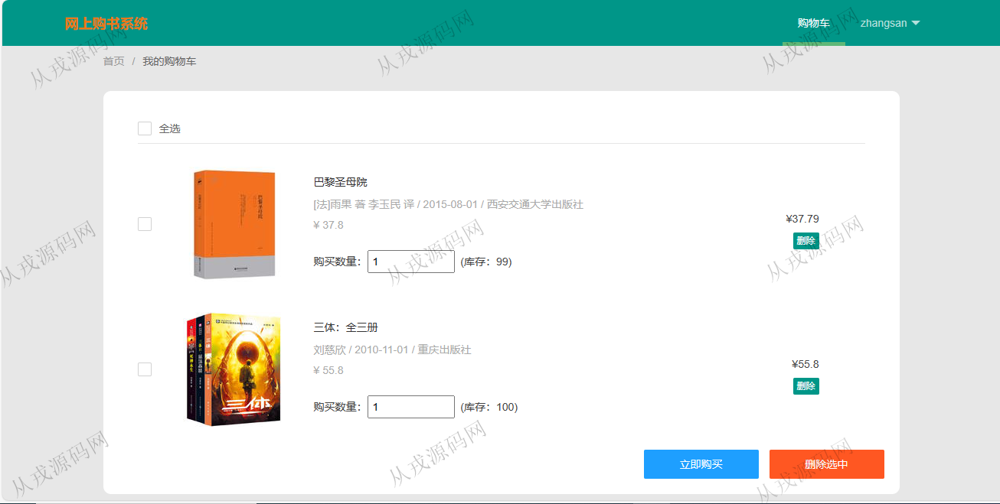
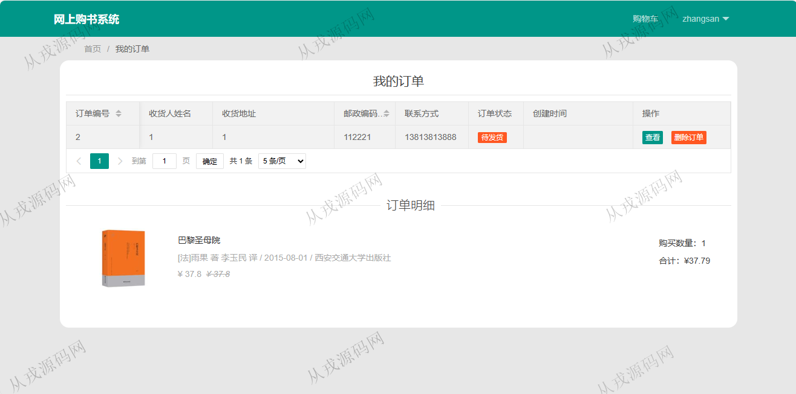
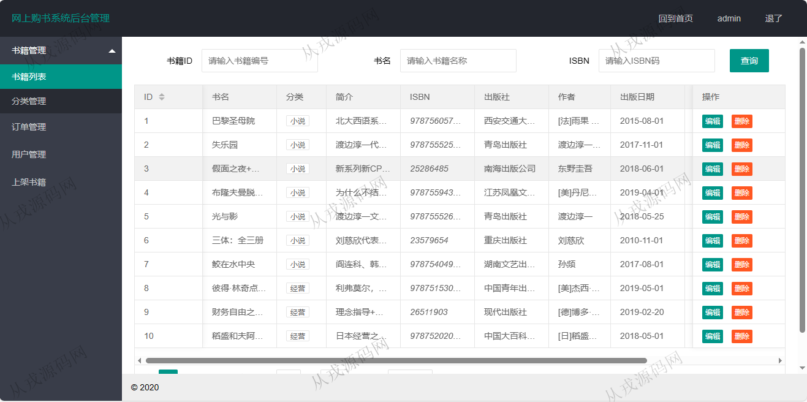
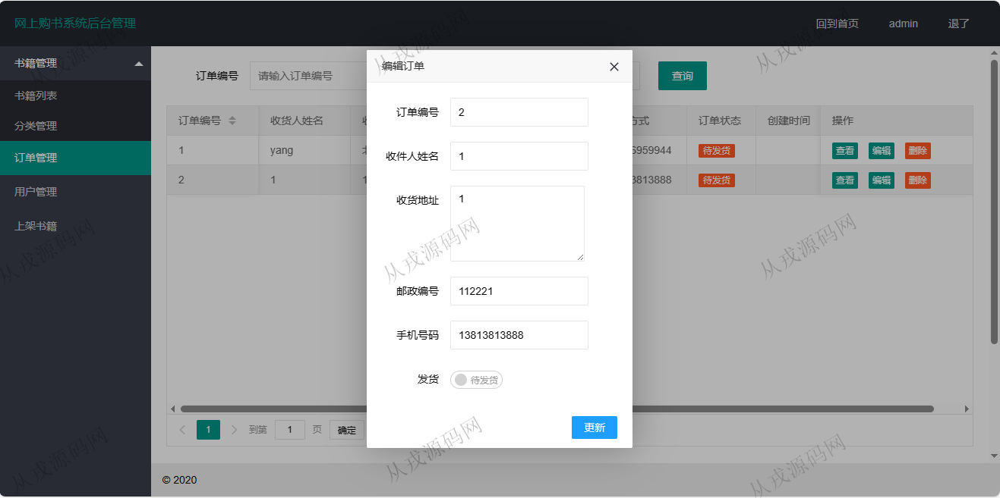

<h1 align="center">75.网上书店管理系统</h1>

 获取sql文件 QQ: 386869957 QQ群: 377586148 

 [推荐站点: 从戎源码网](https://armycodes.com/) 

## 简介

> 本代码来源于网络,仅供学习参考使用!
>
> 提供1.远程部署/2.修改代码/3.设计文档指导/4.框架代码讲解等服务
> 
> 用户端登录地址：http://localhost:8080/login
> 
> 用户：user 123456
> 
> 管理端登录地址：http://localhost:8080/admin/login
> 
> 管理员：admin 123456
>

## 项目介绍
基于springboot的网上书店管理系统：前端thymeleaf、js、layui，后端 maven、springmvc、spring、mybatis，集成书籍管理、分类管理、订单管理、图书浏览、购物车，在线购买等功能于一体的系统。

## 功能介绍

### 用户

- 基本功能：登录，注册，退出
- 首页：全局图书搜索，图书分类列表
- 图书在线购买：图书详情，立即购买，加入购物车，购物车列表，收货信息填写，订单提交
- 我的订单：订单列表查询，订单详情查看，删除订单

### 管理员

- 书籍管理：书籍信息的删改查，多条件搜索查询
- 分类管理：分类信息的增删改查，关键词查询
- 订单管理：订单列表，订单查看详情，订单信息编辑，订单删除，订单发货，多条件搜索查询
- 用户管理：用户信息的查询，编辑，删除
- 上架书籍：书籍信息的录入，录入信息需要提前配置好数据分类，书籍图片上传

## 环境

- <b>IntelliJ IDEA 2021.3</b>

- <b>Mysql 5.7.26</b>

- <b>Tomcat 7.0.73</b>

- <b>JDK 1.8</b>

## 运行截图

